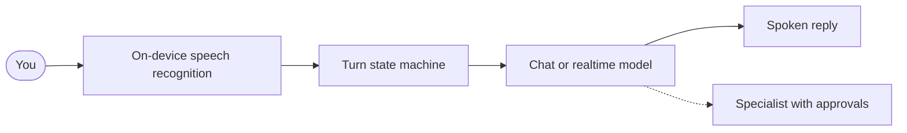

```
 ╔══════════════════════════════════════════════════════════════════════════════╗
╔╝                                                                              ╚╗
║   ██████╗ ██████╗ ███╗   ███╗██████╗  █████╗ ███╗   ██╗██╗ ██████╗ ███╗   ██╗  ║
║  ██╔════╝██╔═══██╗████╗ ████║██╔══██╗██╔══██╗████╗  ██║██║██╔═══██╗████╗  ██║  ║
║  ██║     ██║   ██║██╔████╔██║██████╔╝███████║██╔██╗ ██║██║██║   ██║██╔██╗ ██║  ║
║  ██║     ██║   ██║██║╚██╔╝██║██╔═══╝ ██╔══██║██║╚██╗██║██║██║   ██║██║╚██╗██║  ║
║  ╚██████╗╚██████╔╝██║ ╚═╝ ██║██║     ██║  ██║██║ ╚████║██║╚██████╔╝██║ ╚████║  ║
║   ╚═════╝ ╚═════╝ ╚═╝     ╚═╝╚═╝     ╚═╝  ╚═╝╚═╝  ╚═══╝╚═╝ ╚═════╝ ╚═╝  ╚═══╝  ║
╚╗                                                                              ╔╝
 ╚══════════════════════════════════════════════════════════════════════════════╝
```

# Companion

Talk to your Mac, or type: Companion answers in one thread and can hand real work to a specialist, under permissions you control.

[](https://github.com/karenrebecag/Companion/actions/workflows/ci.yml)


[](LICENSE)

## What you can do

- **Ask without leaving what you are doing.** Hold `fn` anywhere, say "what's on my screen?", let go, and get the answer spoken and written in the same thread. Typing works the same way.
- **Have a conversation, hands free.** With an OpenAI key, start a live voice conversation and interrupt it whenever you want: by tapping always, and by voice when the output is echo-free, for example with headphones.
- **Hand off a chore.** Ask for something that touches files, runs a command or needs the web ("find the PDFs in this folder and summarize them"). A specialist does it in the background while you keep talking.
- **Stay in control of what it changes.** Edits, overwrites and commands show a permission sheet first; only a brand-new plain-text file in a visible folder of the workdir is created without asking. An unanswered sheet times out to "deny".
- **Dictate into the app in front of you.** A separate hold sends your words to the focused text field instead of to the assistant.
- **Carry on after a bad connection.** If the network drops mid-reply in a live voice conversation, what was said stays in the thread and you can say "go on".

## How it works



One pure state machine decides what each turn does, a runtime executes its effects, and the specialist is optional. Diagrams of the turn lifecycle, a realtime turn, a network drop, delegation with approval and the classic fallback are in [`docs/HOW-IT-WORKS.md`](docs/HOW-IT-WORKS.md). The layers and the reasons behind them are in [`docs/ARCHITECTURE.md`](docs/ARCHITECTURE.md).

## Install

You need macOS 26 or later and an OpenAI API key.

1. Download `Companion.dmg` from the [latest release](https://github.com/karenrebecag/Companion/releases/latest), open it, and drag the app to Applications.
2. Open it. The build is **not notarized** (there is no Apple Developer account behind the project), so macOS blocks the first launch. Double-click once and let it be blocked, then go to **System Settings > Privacy & Security** and choose **Open Anyway**. Right-click > Open does not work on macOS 15 and later.

## First run

A short welcome walks you through setup:

1. Your name and the language Companion answers in (English or Spanish).
2. Your keys. The OpenAI key is required; Cerebras (answers in under a second) and ElevenLabs (a more natural voice) are optional. There is also a way to continue without a key, on this Mac only.
3. Four permissions: Microphone, Accessibility, Screen Recording and Speech Recognition.
4. The `fn` key. If it opens emoji or dictation, choose "Do Nothing" for it in Keyboard settings.
5. A microphone check, then your first turn: hold `fn` and say "what's on my screen?".

Optional specialists, Claude Code and Hermes, are detected at runtime. The app is fully usable without them.

## Privacy and security

- **Keys live in the macOS Keychain.** Companion has no server of its own. Network calls go to the services you configured keys for, such as OpenAI.
- **Permissions are asked for, not assumed.** Microphone, Speech Recognition, Accessibility and Screen Recording are requested through the system prompts shown in the welcome flow.
- **The specialist works in one folder.** File tools only touch paths inside the working folder, with symlinks resolved so a link cannot lead out. If you never choose a folder, the working folder is your home folder, and a choice of home is not remembered between launches.
- **Changes ask first.** Editing a file, running a command and replacing existing content go to the permission sheet. A few purely additive actions, such as creating a brand-new plain-text file (txt, md, csv, log) in a visible folder you chose, do not ask. Unanswered requests are denied after 60 seconds, and a decision can be remembered for the session only.
- **Spoken approval is limited on purpose.** A spoken "no" always counts. A spoken "yes" is accepted only in the classic pipeline, after the voice asked, and only if you said a short, clear yes. In realtime, approving needs a click.

## Status and roadmap

This is a personal project and a portfolio piece, not a commercial product. The engineering and process are mature for that scope. Open gaps, stated plainly:

- **First run for a stranger.** The ad-hoc build, four permission prompts and a required API key are real walls.
- **Delegation is hard to discover.** The most distinctive capability does not explain itself, so you have to learn what to ask for.
- **A request nobody looks at is denied after 60 seconds**, quietly.
- **Continuity.** Conversations and per-folder job sessions persist, but there is no local knowledge layer that accumulates context about you.

The voice no longer reads a job's result back: the specialist's text is the message and the voice only acknowledges it ([ADR 005](docs/DECISIONS.md)). Wave status and the measured gap against the original prototype are in [`docs/ROADMAP.md`](docs/ROADMAP.md).

**Next, not a commitment:** local knowledge under your control, an inspectable store of notes, preferences and project context that the model can query through tools, under the same approval and folder rules. **Deferred on purpose:** a vision model driving arbitrary system UI. It is expensive in reliability, permissions and scope, and it does not strengthen the core idea of natural conversation plus deliberate, bounded local agency.

## Built spec-driven

Spec-driven end to end. The owner wrote the specs, the architecture rules, the ADRs and the wave program; the implementation was produced by orchestrated agents under those contracts. Zero lines of application code were written by hand.

The project started as a working prototype and was rebuilt from zero with a strict process: specs, then TDD, then gates, then close. The rebuild was not a rewrite for its own sake. It kept the behaviour that only shows up on real hardware and replaced a structure that had become hard to reason about.

### Decisions that matter

These are the product and engineering choices that define the project more than any feature list.

| Decision | Why |
|----------|-----|
| **No required external agent runtime** (ADR 001) | Hermes was powerful and also a full ecosystem. Requiring it killed adoption for a personal tool. Capabilities were absorbed natively; Claude Code / Hermes remain optional adapters. |
| **No Sparkle** (ADR 002) | Updates check GitHub Releases with a small, testable client. Adding an update framework would be a second binary dependency on a project that treats supply chain as a first-class concern. |
| **No binary dependencies** (ADR 003 retired) | The one vendored binary (Rive, for the mascot) left when the orb became the identity. Any binary needs its own ADR. |
| **Ad-hoc signing for releases** | There is no Apple Developer account behind the project. Gatekeeper blocks the first open; the Install section has the steps. Notarization is supported by the scripts the day credentials exist. |
| **Approvals for destructive tools** | The specialist is useful only if it is trusted. Writes and shell commands ask. File paths cannot leave the chosen workdir, including via symlinks. |
| **Spec-first waves, gates before merge** | Every non-trivial change starts as a written contract. `scripts/gates.sh` (build, static checks, layer rules, tests) is the same script run in CI and locally. |
| **Ledger of hardware scars** | Audio, permissions and realtime behaviour that only appear on real Macs are written down in [`docs/REFERENCE.md`](docs/REFERENCE.md) so they are not rediscovered. |

What was deliberately left out is as important as what shipped: no mandatory Python stack, no silent update framework, no unbounded tool surface in the native executor.

## Build from source

```bash
swift build
swift test           # Swift Testing
scripts/gates.sh     # full compliance suite

scripts/bundle.sh          # debug .app (Companion Next), required for voice
open "build/Companion Next.app"

scripts/bundle.sh release  # product identity, for packaging
```

Voice requires the bundle: macOS only shows microphone and speech prompts when usage descriptions are present in an Info.plist.

Run `scripts/make-signing-cert.sh` once. Without a stable signing identity every rebuild is a different app to macOS, so the microphone grant is dropped and the mic reports 0 Hz.

Debug and release use different bundle IDs on purpose so Launch Services never opens the wrong binary. See [`docs/DISTRIBUTION.md`](docs/DISTRIBUTION.md).

## Documents

| Document | What it is |
|----------|------------|
| [`docs/HOW-IT-WORKS.md`](docs/HOW-IT-WORKS.md) | How a turn works, with diagrams: realtime, network drop, delegation, classic |
| [`docs/ARCHITECTURE.md`](docs/ARCHITECTURE.md) | Layers, ports and adapters, concurrency rules, test layers |
| [`docs/PROGRAM.md`](docs/PROGRAM.md) | Rebuild method (waves, specs, TDD, gates) |
| [`docs/REFERENCE.md`](docs/REFERENCE.md) | Ledger of behaviour learned on real hardware |
| [`docs/DECISIONS.md`](docs/DECISIONS.md) | ADRs |
| [`docs/ROADMAP.md`](docs/ROADMAP.md) | Wave status and measured gaps |
| [`docs/DISTRIBUTION.md`](docs/DISTRIBUTION.md) | Signing, Gatekeeper, updates |
| [`CONTRIBUTING.md`](CONTRIBUTING.md) | How changes are expected to land |

## Contributing

See [`CONTRIBUTING.md`](CONTRIBUTING.md). Read [`docs/REFERENCE.md`](docs/REFERENCE.md) before touching audio, permissions, or the realtime protocol: most of that behaviour is invisible to tests. `scripts/gates.sh` must be green before a change is considered done.

## License

[MIT](LICENSE).
