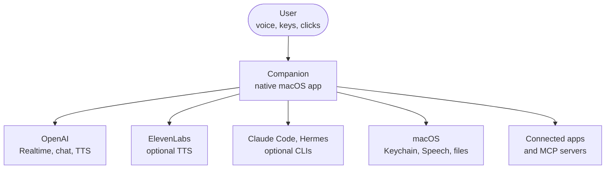
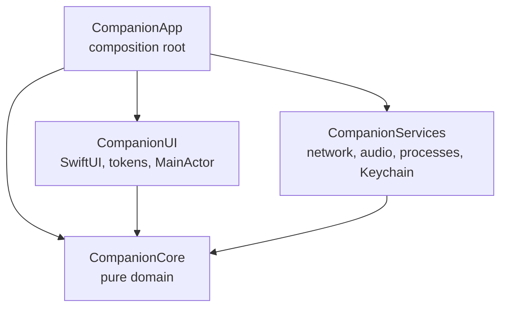

# Architecture

Native macOS voice companion. Swift 6 (strict concurrency), SPM, no Xcode
project required — Command Line Tools are enough to build, test and run.

## System context (C4 level 1)

Who and what Companion talks to. The app is one process on the Mac; every
arrow that leaves the machine goes to a service you configured a key for, and
the specialist CLIs are optional.



## Layers = SPM targets

This is the container view (C4 level 2): the four targets of `Package.swift`,
with arrows showing which target may import which. `CompanionCore` imports
nothing from the others.



```
CompanionApp        composition root: builds adapters, injects, launches
  ├─ CompanionUI    SwiftUI views, design tokens, cards  (MainActor default)
  ├─ CompanionServices  adapters: network, audio, subprocesses, Keychain
  └─ CompanionCore  pure domain: state machine, codecs, parsing  (Foundation,
                    CoreGraphics, CryptoKit only)
```

Dependencies only point downward. The compiler enforces this: a forbidden
import is a build error, not a review comment. `scripts/gates.sh` adds the
framework-level rules SPM can't express.

### Layer rules in `scripts/gates.sh`

SPM stops a target from importing another target. It does not stop a target
from importing an Apple framework it should not know about, so Gate 3 greps for
those imports:

| Layer | Must not import |
|---|---|
| `CompanionCore` | SwiftUI, AppKit, AVFoundation, WebKit, Combine, CoreLocation, MapKit |
| `CompanionServices` | SwiftUI |
| `CompanionUI` | AVFoundation, WebKit |

Gate 3 also checks that nothing outside `SessionMachine` writes the session
projection, that `SessionMachine` is extended only in its own files, that no
layer declares `public` or `open`, and that the test targets respect their own
layering (see Testing). The other gates cover the build in debug and release
(Gate 1), static checks (Gate 2: no hardcoded secrets, no `print` or `NSLog`, no
file over 800 lines, no `try?` in Core and Services, every `URLSession` built
through `NoStoreSession`) and the test suite (Gate 4).

Cross-target API is `package`, not `public` (SE-0386): visible to every
target in this package and to nothing outside it. The package ships an
executable, not a library, so there is no external API to declare. A symbol
that another target does not need stays `internal`. Gate 3 of
`scripts/gates.sh` rejects any `public` or `open` declaration in Core,
Services and UI, so a new public API cannot slip in unnoticed. The test
support targets use `package` too.

## Folders inside a target

Each target groups its files by domain (`Voice/`, `Chat/`, `Browser/`,
`Bridge/`, `Tools/`, `Deliverables/`...), and a domain keeps the same name in
every target it spans: `CompanionCore/Browser` holds the ports and policy,
`CompanionServices/Browser` the adapters, `CompanionUI/Settings` the view.
The pairing is what would let a domain become its own module later
(interface + live implementation) without renaming anything.

A file that only extends a type is named `Type+Concern.swift`
(`VoiceSession+Pumps.swift`), so the type it belongs to reads from the
name. `Skills`, `Diagram`, `Fonts` and `Mascot` are copied resources in
`Package.swift`: no source folder may take those names.

## Pattern: ports & adapters around a pure core

- **Core defines ports** — protocols like `VoiceTransport`, `ChatProvider`,
  `Executor`, `Transcriber`, `SpeechSynthesizer`, `SecretStore`. Core never
  knows which implementation exists or whether one is installed.
- **Services implement adapters** — `RealtimeWSTransport`,
  `ChatProviderClient`, `ClaudeCodeExecutor`… Optional capabilities (Claude
  Code, Hermes) are *detected at runtime*, never assumed. The product must be
  fully usable with nothing but an OpenAI API key.
- **The composition root wires it** — `CompanionApp` is the only place that
  names concrete adapters.
- **Adapters that must know each other expose a wiring init** — when two
  adapters share a framework object the app layer should never hold (the
  audio player joining the mic's `AVAudioEngine`), Services offers an init
  taking the concrete peer, e.g. `RealtimePlayer(sharedWith: MicCapture)`.
  Depending on the concrete type is deliberate: it keeps non-Sendable
  framework types inside Services instead of leaking into the root.

## State: reducer, not scattered mutation

The turn lifecycle (idle → connecting → listening → thinking → speaking) is a
value-type state machine: `handle(event) -> [Effect]`. Pure, exhaustively
tested, no I/O. A runtime in Services executes effects and feeds results back
as events. (If you come from the web: it's a Redux reducer with an effect
interpreter.)

Since Wave 12a there are two reducers, one projection: `TurnMachine` owns
how the voice captures and plays; `SessionMachine` (Core) observes its
snapshots and owns what the chrome shows — Idle / Hover / Listening /
Processing(phase) — plus typed turns, the parent's hands, the specialist's
job and the approval queue. `SessionModel` (UI) is the only writer of the
projection; views read it, view models send events. A failure or a stop is
an `InterruptReason` on the way back to Idle, never a kind of its own.

## Concurrency rules

- Swift 6 language mode everywhere; data races are compile errors.
- `CompanionUI` and `CompanionApp` default to `@MainActor`
  (`.defaultIsolation(MainActor.self)` in Package.swift).
- Long-lived sessions are `actor`s in Services (`VoiceSession`,
  `RealtimeWSTransport`, `Approvals`).
- State that really is shared across tasks sits behind a `Mutex` from the
  `Synchronization` framework, never behind an ad-hoc lock. `ClassicRuntime`
  is the example: it is a class that several tasks run at once, and its three
  cross-task fields live in one struct under one `Mutex`, so a read and clear is
  a single step with no `await` inside.
- Async methods of a helper that an actor owns are marked
  `nonisolated(nonsending)`. They run on the caller's actor instead of hopping
  to the global executor, so `RealtimeRuntime` (a class, not an actor) is used
  exclusively through `VoiceSession` and the executor enforces that, not just a
  comment.
- Events flow as `AsyncStream`, not stored callback closures.
- Cancellation is structured (`Task.cancel()`). The one generation number left,
  `realtimeGeneration` in `VoiceSession`, does not cancel anything: it tells a
  pump of an old socket from the pump of the live session after a reconnect.
- `DispatchSemaphore` never blocks an async context.

### ThreadSanitizer

Compile-time checks do not catch everything. CI has a `tsan` job
(`.github/workflows/ci.yml`) that runs the whole suite under ThreadSanitizer
with `scripts/tsan.sh`, on its own runner so its build never overwrites the
debug binaries the `gates` job tests. TSan was the only tool that reproduced the
races in the bridge and in the classic runtime. The job is informational today
(`continue-on-error: true`): a warning turns it red without blocking a merge. It
becomes a required check after 5 clean runs in a row. The same command runs
locally with `scripts/tsan.sh`; do not run it at the same time as
`scripts/gates.sh` in one checkout, because they share the debug build folder.

## Observation

View models use `@Observable` (Observation framework), split by concern
(chat, voice, settings) — not one god object. Views re-render only on the
properties they actually read.

## Errors and logging

No silently swallowed errors: `try?` is banned in Core and Services (gate).
Every failure path either recovers deliberately or logs through `Log` with
context. Unknown protocol events are logged, never dropped silently.

## Configuration boundary

One `Config` type owns every external fact: API keys (Keychain), model names,
endpoints, detected executors. Product behaviour never depends on the
environment, the home directory or dotfiles. Two narrow exceptions exist, and
neither is required: `Config` reads opt-in developer switches from environment
variables (`COMPANION_DECISION`, `COMPANION_DEBUG_TRANSCRIPTS`), and
`HermesProviderScan` reads Hermes's own model cache in `~/.hermes` to detect an
optional CLI, behaving the same when it is missing. This is what keeps the app
distributable.

## Testing

Swift Testing (`@Test` / `#expect`), one test target per layer under
`Tests/<Target>/` (flat folders, so `#filePath` depth is the same everywhere):

| Test target | Depends on | Holds |
|---|---|---|
| `CompanionCoreTests` | Core | domain: codecs, state machines, policies |
| `CompanionServicesTests` | Core, Services | adapters: network, processes, bridge |
| `CompanionUITests` | Core, UI | views, view models, copy; no resources |
| `CompanionIntegrationTests` | Core, Services, UI | flows that cross layers |
| `CompanionTests` | all | transitional: the voice files, until the VoiceSession split |

Shared fakes live in four regular support targets (not test targets, never
`@testable`, API `package`): `CompanionTestKit` (harness, conformance, fixtures;
no Companion dependency), `CompanionCoreTestSupport` (Core + TestKit),
`CompanionServicesTestSupport` and `CompanionUITestSupport` (each: its layer +
CoreTestSupport + TestKit). A support target never carries `swiftSettings`, so
UI's `defaultIsolation` does not leak into the fakes. Each test target depends
on its layer's support target (for example `CompanionServicesTests` on
`CompanionServicesTestSupport`), as declared in `Package.swift`.
`scripts/check-test-layers.sh`
(run by Gate 3) enforces this: R1 no `@testable` outside `*Tests`; R2 import
direction between test and support targets; R3 (on `dump-package`) support
targets are regular, settings-free, depend only on what the table allows, no
production target depends on them, and UI test targets have no resources; R4 no
`@_exported import` (`CompanionTests` exempt until it disappears). Outside
`CompanionTests` (until PR 4), imports of support modules are explicit in every
file. `scripts/gates.sh` runs build (debug and release) + static checks +
architecture checks + tests; it must be green before any merge. Two contracts are data, not prose: `conformance/ui-contract.json`
(grid and projection rules over `Sources/CompanionUI`, a ratchet on old debt)
and `conformance/hud-gates.json` (the HUD's auditor gates, each citing the
tests that prove it; the runner fails when a cited test disappears).
