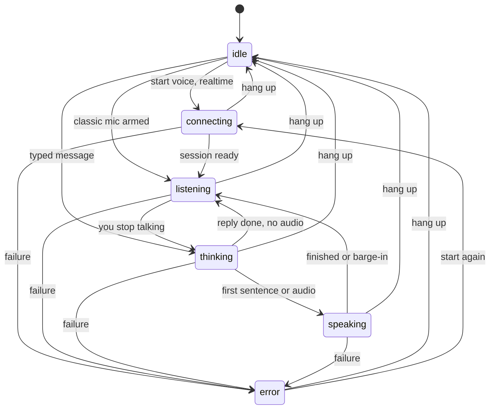
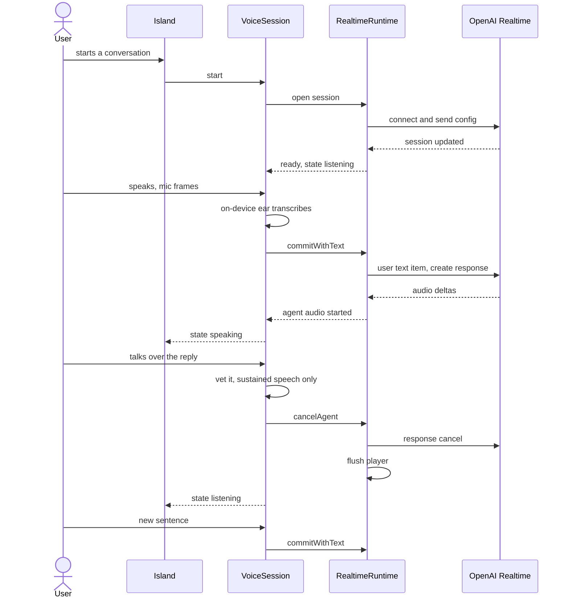
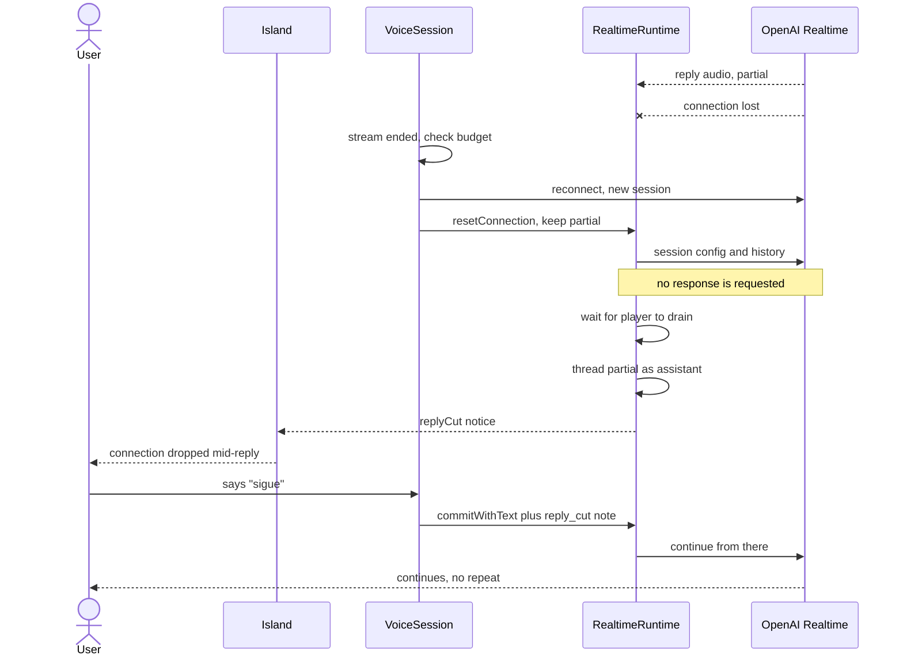
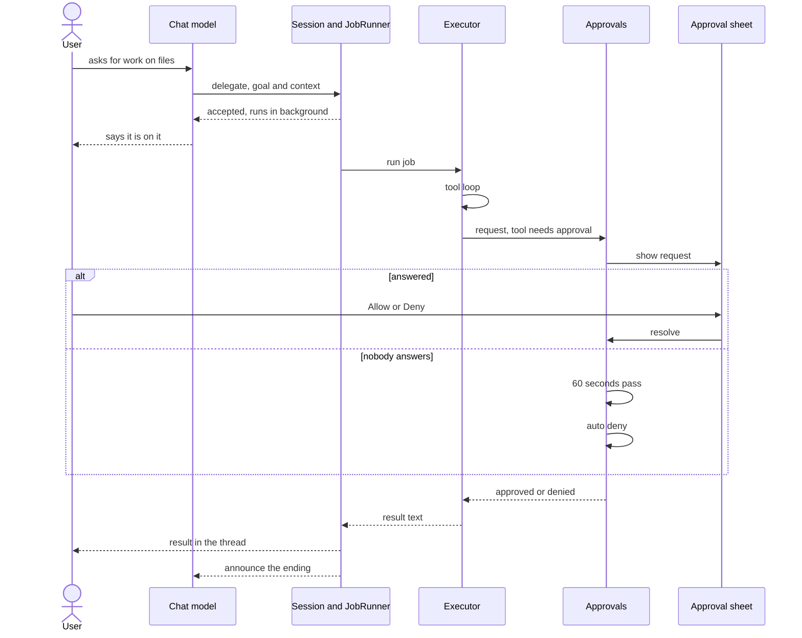
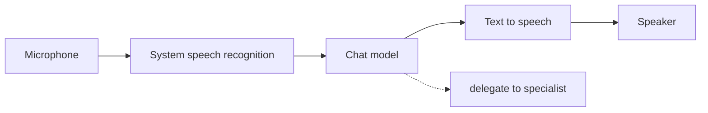

# How Companion works

This page explains what happens between you speaking and Companion answering,
and what happens when something goes wrong. It is explanation, not a
how-to: for installing, see the [README](../README.md); for the layer rules and
the reasons behind them, see [`ARCHITECTURE.md`](ARCHITECTURE.md).

Every diagram below is drawn from the code. Type names are the real ones, so
you can search for them.

## The turn lifecycle

A turn is one round of "you say something, Companion answers". Its rules live
in one pure value type, `TurnMachine` (`Sources/CompanionCore/Session/TurnMachine.swift`).
It does no I/O: it receives a `TurnEvent` and returns a list of `TurnEffect`
values, such as `.openRealtimeSession` or `.cancelAgentOutput`. A runtime in
`CompanionServices` executes the effects and feeds what happens back as new
events. The states are the cases of `TurnState`.

Three details are worth knowing, all visible in `TurnMachine`:

- **Failure is a state with a reason.** Entering `error` records a
  `TurnFailure` (`micDenied`, `networkUnavailable`, `quotaExceeded`,
  `sessionDropped` and so on), so the interface can say what to fix instead of
  showing one generic error. Once a hands-free conversation is under way, a
  failure does not go to `error` the first time: the machine drops to the
  classic pipeline and keeps listening. A failure while already recovering, or
  during a hold, goes to `error`.
- **A hold is its own kind of turn.** Pressing the key (`holdPressed`) opens
  the mic, releasing it (`holdReleased`) closes the mic and sends what the ear
  heard, and discarding it (`holdDiscarded`) closes the mic and sends nothing. A hold starts from
  rest on the classic pipeline and returns to `idle` after its reply is
  spoken; hands-free returns to `listening`.
- **Echo is guarded in time.** After the agent stops speaking, the machine
  ignores the mic for `echoGuardDuration` (0.35 seconds), so the tail of the
  agent's own voice is not heard as you.

`SessionMachine`, a second reducer, observes the snapshots of this one and
owns what the island shows: idle, hover, listening, processing, plus the
specialist job and the approval queue. The two are kept apart on purpose: one
decides how the voice captures and plays, the other decides what the screen
says.

## A realtime voice turn

The realtime path is used for hands-free conversation when an OpenAI key is
present. One detail shapes everything else: Companion turns OpenAI's own
listening off (`turn_detection` is `null` in `RealtimeCodec`). Your voice is
transcribed on the Mac by the on-device speech engine (the "ear", wrapped by
`VoiceAudit`), and the finished text is what is sent to OpenAI as the user turn.
OpenAI then answers with audio, which `RealtimePlayer` plays. The effect is
that the words that drive the turn are the accurate on-device transcript, and
the mic audio is never what the conversation model reasons over.

`VoiceSession` is the actor that owns a live session. `RealtimeRuntime` is its
protocol layer: it sends and decodes Realtime events, and keeps the single
in-flight response straight.

Barge-in has two guards, because speakers feed the agent's voice back into the
mic. When the output is not echo-free, the ear is closed while the agent
speaks. When the Mac has echo cancellation or you wear headphones, you can
interrupt by voice, but only sustained speech over the agent counts: a short
backchannel such as "uh-huh" does not cut it off (`BackchannelGate`,
`EchoGuard`). Tapping the stop control always works, because it does not depend
on the mic at all.

## A network drop in the middle of a reply

Connections fail. Companion treats a dropped realtime socket as something to
recover from quietly, not as a reason to leave you with a voice that is
"speaking" into nothing. The logic is in
`VoiceSession+Pumps.swift` and `RealtimeRuntime.swift`.

When the event stream ends while the session is listening or speaking,
`VoiceSession` checks that the Mac is online and that a reconnect is allowed.
A reconnect is allowed once per ready connection, and at most three times in any
60 seconds (`reconnectBudget`, `reconnectWindow`). That limit exists so a
server that accepts and then drops again and again cannot loop forever. If the
budget is spent or the network is gone, the turn fails with `sessionDropped`.

What this guarantees, and where it is enforced:

- **What was said is kept.** `resetConnection` takes the words of the response
  that was still open (`dropInFlightResponse`) and holds them as the cut reply.
  They join the conversation thread as the assistant's message only once the
  player has drained, so the thread never shows words your ears have not
  reached.
- **It reconnects with its configuration.** A reconnect is a new server
  session, so `reconnectRealtimeSession` sends the session config and the
  conversation history again before anything else. Your mute is preserved: a
  reconnect does not turn the mic back on.
- **It never speaks by itself.** The reconnect path sends configuration only;
  it does not request a response, so the reconnect itself never makes
  Companion talk.
- **The island says what happened.** `RealtimeRuntime` emits `.replyCut`, which
  `SessionMachine` turns into a notice: "Connection dropped mid-reply. Back
  online. Say "go on" to continue." The notice fades by itself, it does not
  cover an error or a pending permission, and it does not appear if the voice is
  off.
- **"Go on" resumes.** There is no special command. The next user turn carries a
  one-shot `<reply_cut>` note (`ContextBlock`) with the tail of what was said
  before the cut, and tells the model to continue from there without repeating
  it. If you say something unrelated instead, that turn consumes the note.

One known limitation is recorded in the code: the partial is the generated
transcript, not the audio that was actually played, so it can include words you
never heard.

## Delegating to a specialist

Companion can hand a job to a specialist that has files, a shell and the web.
The chat model starts this by calling the `delegate` tool, with a one-line
`goal` and some `context`. The job then runs off the conversation, so the voice
does not stall while it works.

The specialist is chosen by `WorkRouting`: a detected CLI specialist (Claude
Code or Hermes) when one is installed, otherwise the built-in `NativeExecutor`.
Jobs run one at a time through `JobQueue`. Inside the native executor, safe
tools such as `read_file`, `list_directory` and `web_search` run directly. Tools
that change things, such as `write_file`, `edit_file` and `run_shell`, go
through the approval path below. A write that only adds a new plain-text file in
a visible folder you chose can act without the sheet (`ActionBand`); replacing
an existing file or running a command cannot.

The approval has three properties that are enforced in code:

- **Silence is a no.** `Approvals` is an actor that parks the request on a
  continuation and starts a timer. When `ApprovalTiming.autoDeny` (60 seconds)
  passes with no answer, it resolves the request as denied and marks it
  `timedOut`. The countdown ring on the sheet reads the same constant, so it
  does not lie.
- **A spoken "yes" has to be earned.** In the realtime pipeline a spoken yes
  never approves; only a click does. In the classic pipeline the voice asks the
  question aloud in a fixed sentence, and a later hold may answer it, but only if
  the words you said in that hold are a short, clear yes (`SpokenYes`). A spoken
  "no" is always honoured, because refusing is the safe direction.
- **Decisions can be remembered for the session.** The sheet has a toggle that
  keeps a decision, keyed by `ApprovalKey`, for the life of the process.

When the job ends, the specialist's text lands once in the thread as the
assistant's message, and the voice only acknowledges that it finished
(`VoiceJobBridge`, `Escalation`). The reasoning for this is
[ADR 005](DECISIONS.md).

## The classic pipeline

The classic pipeline is the path that does not need the realtime socket:
microphone, the system speech recognizer, a chat model, then text to speech.
`ClassicRuntime` runs it. Unlike realtime, there is no server loop, so the
runtime itself loops over tool calls and speaks sentences as the chat model
streams them.

`TurnMachine` and `VoiceSession` choose it in these situations:

- **A hold from rest.** The press-and-hold key starts a turn on the classic
  pipeline (`holdPressed(preferRealtime: false)`), because a hold is the text
  path: you speak, release, and get a reply.
- **No OpenAI key.** Hands-free `start()` asks for realtime only when a key is
  present.
- **Realtime could not start.** If the socket fails to open while the Mac is
  online, `failRealtimeStart` starts classic instead. If the Mac is offline it
  reports `networkUnavailable` rather than listening in silence.
- **Recovery in a conversation.** A failure during a hands-free conversation
  drops to classic listening once, instead of ending the conversation.

The mouth is picked per sentence by `MouthRouter`: ElevenLabs first when you
have chosen it and it is healthy, otherwise OpenAI text to speech. When a job
ends, classic cannot ask a realtime model to narrate, so `ClassicRuntime`
speaks a fixed line of its own followed by a short summary written by the chat
model.
